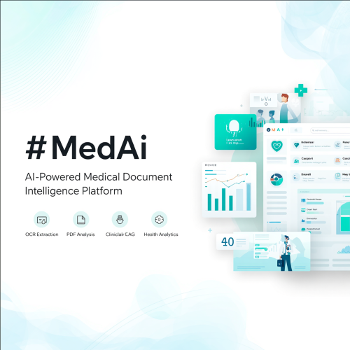
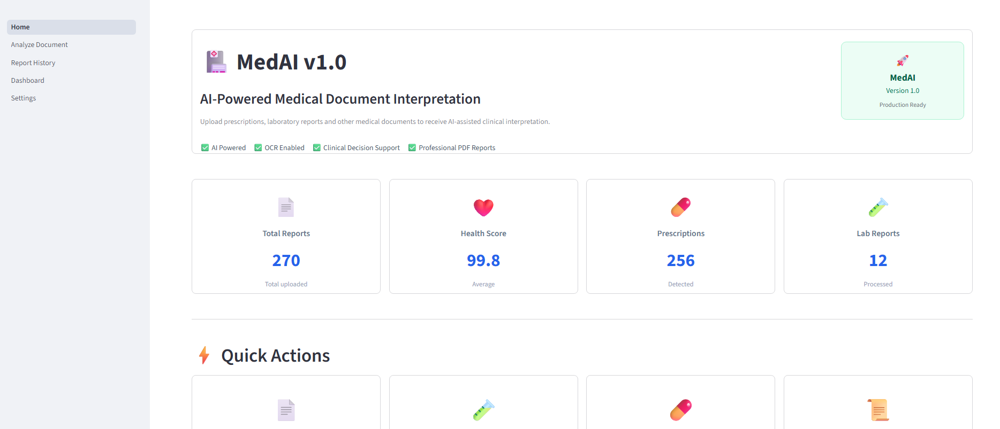

<p align="center">
  
</p>

# 🏥 MedAI – AI-Powered Medical Document Intelligence Platform

<p align="center">
  
</p>

<p align="center">
  <strong>Upload medical prescriptions and laboratory reports, extract clinical data using OCR, analyze findings with AI, and generate structured medical insights through a modern analytics dashboard.</strong>
</p>

<p align="center">
  
  
  
  
  
  
  
</p>

---

## 📖 Overview

MedAI is a full-stack AI-powered healthcare application that processes medical prescriptions and laboratory reports from **PDFs, scanned documents, and images**.

The platform automatically extracts text, identifies medicines and laboratory parameters, calculates a health score, generates patient summaries, and stores reports for historical analysis.

The application combines **OCR, PDF parsing, rule-based clinical analysis, and AI-assisted interpretation** to provide structured medical insights through a modern web interface.

---

## ✨ Key Features

### 📄 Medical Document Analysis
- Prescription analysis
- Laboratory report analysis
- Automatic document type detection
- OCR-powered text extraction
- Digital PDF text extraction (PyMuPDF)
- OCR fallback for scanned PDFs and images

### 🧪 Clinical Intelligence
- Medicine detection
- Laboratory parameter extraction
- Reference range comparison
- Health score calculation
- Clinical summary generation
- Patient-friendly report summaries
- Doctor advisory generation
- Red flag detection

### 📊 Analytics & History
- Report history
- Searchable patient records
- Document filtering
- Health score analytics
- Document distribution dashboard
- Patient analytics

### 🖥️ Modern User Interface
- Streamlit dashboard
- Professional medical report layout
- Interactive visualizations
- Responsive design
- Swagger API documentation

---

## 🏗️ System Architecture

```text
                     User
                       │
                       ▼
               Upload PDF / Image
                       │
                       ▼
                Streamlit Frontend
                       │
                       ▼
                 FastAPI Backend
                       │
        ┌──────────────┼──────────────┐
        │              │              │
        ▼              ▼              ▼
   PDF Parser      OCR Engine     AI Analysis
   (PyMuPDF)     (Tesseract)   (Clinical Logic)
        │              │              │
        └──────────────┼──────────────┘
                       ▼
               Structured Medical Data
                       │
                       ▼
                 Report Database
                       │
                       ▼
           Dashboard & Report History

## 📂 Project Structure

```text
MedAI/
│
├── backend/
│   ├── data/
│   ├── models/
│   ├── routes/
│   ├── services/
│   ├── database.py
│   └── main.py
│
├── frontend/
│   ├── components/
│   ├── pages/
│   ├── utils/
│   └── Home.py
│
├── docs/
├── sample_reports/
├── screenshots/
├── requirements.txt
├── README.md
└── .gitignore
```

## 🚀 Getting Started

### Clone the repository

```bash
git clone https://github.com/mohansingh77-creator/MedAI.git
cd MedAI
```

### Create a virtual environment

**Windows**

```bash
python -m venv venv
venv\Scripts\activate
```

**macOS / Linux**

```bash
python3 -m venv venv
source venv/bin/activate
```

### Install dependencies

```bash
pip install -r requirements.txt
```

### Run the backend

```bash
cd backend
uvicorn main:app --reload --port 8001
```

### Run the frontend

Open a new terminal:

```bash
cd frontend
streamlit run Home.py
```

### Open the application

**Frontend**

```
http://localhost:8501
```

**Swagger API**

```
http://127.0.0.1:8001/docs
```
## 📡 REST API

### Analyze Medical Document

```http
POST /api/v1/documents/analyze
```

Upload a prescription image, scanned PDF, or laboratory report and receive structured medical analysis.

### Get Report History

```http
GET /api/v1/reports
```

Returns all previously analyzed reports.

### Health Check

```http
GET /health
```

Returns backend service status.

## 🧠 Clinical Processing Pipeline

The MedAI analysis engine follows a structured medical document processing workflow.

```text
Upload Document
      │
      ▼
Detect PDF / Image
      │
      ▼
Extract Text (PyMuPDF)
      │
      ▼
OCR Fallback (Tesseract)
      │
      ▼
Document Type Detection
      │
      ▼
Patient Information Extraction
      │
      ▼
Medicine Detection
      │
      ▼
Laboratory Parameter Parsing
      │
      ▼
Health Score Calculation
      │
      ▼
Clinical Summary Generation
      │
      ▼
Database Storage
      │
      ▼
Dashboard & Report History
```

This pipeline enables MedAI to process **digital PDFs, scanned PDFs, and image-based medical documents** with OCR fallback for improved reliability.

## 📚 Documentation

Additional technical documentation is available in the `docs/` folder.

- Database architecture
- API request/response examples
- Swagger interface
- Upload workflow

## 🔮 Future Roadmap

### Phase 2 – Clinical Intelligence

- Medicine interaction checker
- Drug dosage validation
- Side effect prediction
- Abnormal lab trend detection
- Multi-test report correlation

### Phase 3 – AI Assistant

- Conversational medical report explanation
- Patient question answering
- Doctor summary generation
- Follow-up recommendation engine

### Phase 4 – Platform Expansion

- Multi-language OCR
- User authentication
- Cloud deployment (AWS / Azure)
- Docker & CI/CD
- Mobile application
- Electronic Health Record (EHR) integration

## 👨‍💻 Developer

**Mohan Singh**

Finance | FP&A | Business Strategy | AI & Data Applications

- GitHub: https://github.com/mohansingh77-creator
- LinkedIn: www.linkedin.com/in/mohan-singh-54730237

## 📄 License

This project is licensed under the **MIT License**.

You are free to use, modify, and distribute this software for educational and non-commercial purposes.

## 🤝 Contributing

Contributions, feature suggestions, and bug reports are welcome.

If you would like to contribute:

1. Fork the repository
2. Create a feature branch
3. Commit your changes
4. Open a pull request

Please ensure that new features include appropriate documentation and maintain the existing project structure.

## ⭐ Support the Project

If you found MedAI useful, please consider giving the repository a **⭐ on GitHub**.

Your support helps improve the project and encourages future development of AI-powered healthcare tools.

